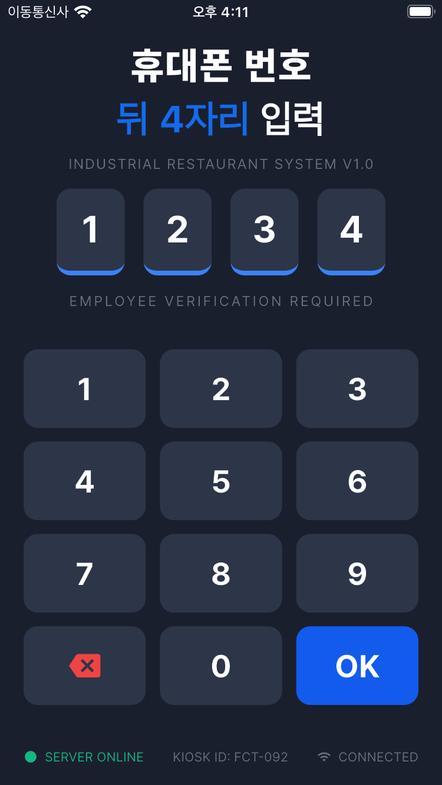
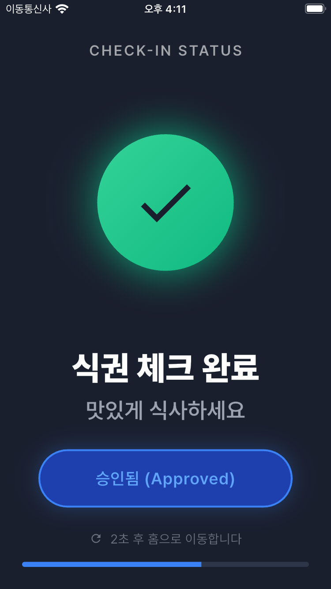

# gongbab (공밥)

`gongbab`은 '공단의 밥'의 줄임말로, 공단 내 여러 회사와 식당을 대상으로 하는 식권 관리 키오스크 앱 프로젝트입니다.

## 📝 Description

사용자가 키오스크에 휴대폰 번호 뒷 4자리를 입력하면, 서버와 통신하여 어느 회사 직원이 어떤 식당에서 몇 시에 식사했는지 확인하고 기록하는 식권 체크 기능을 제공합니다.

## ✨ Technology Stack

- **Framework**: [Flutter](https://flutter.dev/)
- **Language**: [Dart](https://dart.dev/)
- **UI**:
  - [Material Design](https://material.io/)
  - [Cupertino Icons](https://pub.dev/packages/cupertino_icons)
  - [flutter_screenutil](https://pub.dev/packages/flutter_screenutil)
- **Fonts**:
  - [Pretendard](https://github.com/orioncactus/pretendard)
- **Testing**:
  - [flutter_test](https://api.flutter.dev/flutter/flutter_test/library.html)
- **Linting**:
  - [flutter_lints](https://pub.dev/packages/flutter_lints)

## 📸 Screenshots

| Phone Number Input | Success |
| :---: | :---: |
|  |  |

| Pin Input |
| :---: |
|  |

## Getting Started

This project is a starting point for a Flutter application.

A few resources to get you started if this is your first Flutter project:

- [Lab: Write your first Flutter app](https://docs.flutter.dev/get-started/codelab)
- [Cookbook: Useful Flutter samples](https://docs.flutter.dev/cookbook)

For help getting started with Flutter development, view the
[online documentation](https://docs.flutter.dev/), which offers tutorials,
samples, guidance on mobile development, and a full API reference.